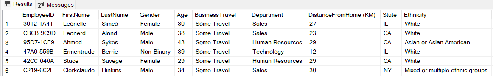

# Proyecto SQL: Análisis de RR.HH. - Rotación y Desempeño de Empleados

## Resumen (Overview)

_El personal de recursos humanos de **GreatPlaceToWork** desea mejorar el desempeño, aumentar la retención y mejorar la satisfacción laboral general. Sin embargo, no cuentan con una visión clara de los datos pertinentes de los empleados. Mi objetivo es utilizar **SQL** dentro de **SQL Server Management Studio**, analizando sus datos para proporcionar recomendaciones al departamento de RR.HH. que faciliten mejoras exitosas._

## Estructura del Proyecto

- [Sobre los Datos](#sobre-los-datos)
- [Tareas](#tareas)
- [Limpieza de Datos](#limpieza-de-datos)
- [Análisis Exploratorio de Datos e Insights](#análisis-exploratorio-de-datos-e-insights)

## Sobre los Datos

Los datos originales, junto con una explicación de cada columna, se pueden encontrar [aquí](https://www.kaggle.com/datasets/mahmoudemadabdallah/hr-analytics-employee-attrition-and-performance/data?select=Employee.csv).

El conjunto de datos incluye cinco tablas que capturan evaluaciones de desempeño, datos demográficos de los empleados, niveles de satisfacción y calificaciones, distribuidos en más de 8,100 registros y 40 columnas.



## Tareas (Task)

En este análisis, ayudo al departamento de RR.HH. a responder lo siguiente:

1. **Antigüedad:** ¿Cuál es el promedio de antigüedad de los empleados en cada departamento?
2. **Retención:** ¿Cuántos empleados en cada departamento siguen trabajando actualmente en la empresa?
3. **Satisfacción vs. Antigüedad:** ¿Cómo se compara la satisfacción laboral de los empleados en diferentes niveles de antigüedad?
4. **Horas Extras:** ¿Qué porcentaje de empleados que trabajan horas extras han dejado la empresa?
5. **Desempeño por Viajes:** Clasificar los departamentos por el promedio de calificación de los gerentes, desglosado por frecuencia de viajes de negocios.
6. **Capacitación:** ¿Existe una correlación positiva entre el número de oportunidades de capacitación tomadas y la satisfacción laboral?
7. **Talento Top:** Identificar a los tres mejores empleados según la calificación de su gerente en cada departamento.
8. **Distancia al Trabajo:** Categorizar a los empleados según su distancia al trabajo y mostrar el promedio de satisfacción laboral en cada categoría.
9. **Promociones y Liderazgo:** ¿Existe una relación entre el número de ascensos y los años que un empleado ha pasado con su gerente actual?
10. **Alerta de Rotación:** Para cada departamento, identificar el porcentaje de empleados que se han ido y que tenían una puntuación de satisfacción laboral inferior a 3.

## Limpieza de Datos

Antes de realizar el análisis, es fundamental asegurar que los datos estén limpios y listos. Dado que las tablas `EducationLevel`, `RatingLevel` y `SatisfiedLevel` son de referencia, el trabajo principal se centra en las tablas `Employee` y `PerformanceRating`.

#### Valores Nulos o Faltantes

Primero, verifiqué la existencia de valores faltantes en los dos campos clave: `EmployeeID` y `PerformanceID`. No se encontraron valores nulos.

```sql
-- Verificar valores faltantes en la tabla Employee --

SELECT COUNT(*) AS MissingValues
FROM Employee
WHERE EmployeeID IS NULL;

--Verificar valores faltantes en la tabla PerformanceRating--

SELECT COUNT(*) AS MissingValues
FROM PerformanceRating
WHERE PerformanceID IS NULL
    OR EmployeeID IS NULL;
```

A continuación, es vital asegurarse de que se eliminen las filas duplicadas, en caso de encontrarse, nuevamente en los campos clave. No se encontraron duplicados.

```sql
-- Verificar valores duplicados en la tabla Employe --

SELECT EmployeeID, COUNT(*)
FROM Employee
GROUP BY EmployeeID
HAVING COUNT(*) > 1;

-- Verificar valores duplicados en la tabla PerformanceRating --

SELECT PerformanceID, COUNT(*)
FROM PerformanceRating
GROUP BY PerformanceID
HAVING COUNT(*) > 1;
```


## Análisis Exploratorio de Datos (EDA) e Insights

### Pregunta #1: ¿Cuál es la antigüedad promedio de los empleados en cada departamento?

Encontré la antigüedad promedio de cada departamento utilizando las funciones ROUND, AVG y GROUP BY. Dado que YearsAtCompany ya es un número entero, decidí mantener la antigüedad promedio también como un número entero (con dos decimales para precisión).

```sql
-- Antigüedad promedio por departamento --

SELECT Department,
    ROUND(AVG(YearsAtCompany), 2) AS AvgTenure_Years
FROM Employee
GROUP BY Department
ORDER BY AvgTenure_Years;
```


_Antigüedad promedio (en años) por departamento_

El departamento de Tecnología tuvo la antigüedad más larga con 4.61 años, seguido de cerca por los departamentos de Recursos Humanos (HR) y Ventas (Sales) con 4.47 y 4.46 años, respectivamente.

La empresa podría proporcionar desarrollo profesional adicional o tutoría adaptada a aquellos departamentos con una antigüedad más corta.

### Pregunta #2: ¿Cuántos empleados en cada departamento siguen trabajando en la empresa?

Para encontrar el número de empleados actuales, solo se necesitaron las funciones básicas COUNT, WHERE , SUBCONSULTAS y GROUP BY.

```sql
-- Empleados Activos --

SELECT Department,
    COUNT(*) AS ActiveEmployees,
    ROUND(COUNT(*) * 100 / (SELECT COUNT(*)
			    FROM EmployeePerformance
			    WHERE Attrition = 'No'), 0
			    ) AS PercentageOfActive
FROM Employee
WHERE Attrition = 'No'
GROUP BY Department
ORDER BY ActiveEmployees DESC;
```


_Empleados activos por departamento y porcentaje del total_

El departamento de Tecnología representa, por mucho, la mayor parte de los empleados activos de la empresa con 828 empleados, más de dos tercios de toda la compañía. En segundo lugar, con menos de la mitad, está Ventas con 354 empleados (29%), siendo Recursos Humanos el departamento más pequeño con un 4% y solo 51 empleados.

Debido a que el departamento de Recursos Humanos es tan pequeño en comparación con los otros dos, podría valer la pena evaluar su estructura y la carga de trabajo de sus empleados, ya que podrían ser necesarios ajustes de personal.

El departamento de Tecnología podría necesitar ser examinado para verificar si la atención gerencial por cada empleado ha disminuido o si está afectando la satisfacción laboral.

### Pregunta #3: ¿Cómo se compara la satisfacción laboral de los empleados con diferentes niveles de antigüedad?

A continuación, utilicé las funciones CASE y JOIN para encontrar la calificación promedio de satisfacción laboral en tres categorías: empleados con menos de tres años, aquellos entre tres y cinco años, y aquellos con más de cinco años.

```sql
-- Average job satisfaction by tenure category --

SELECT 
    CASE 
	WHEN e.YearsAtCompany < 3 THEN '< 3 years'
        WHEN e.YearsAtCompany BETWEEN 3 AND 5 THEN '3-5 years'
        ELSE '> 5 years' 
    END AS TenureCategory,
    ROUND(AVG(p.JobSatisfaction), 2) AS AvgJobSatisfaction
FROM Employee e
JOIN PerformanceRating p ON e.EmployeeID = p.EmployeeID
GROUP BY TenureCategory
ORDER BY AvgJobSatisfaction DESC;

```


_Satisfacción laboral promedio por categoría de antigüedad_

Curiosamente, la categoría con las calificaciones promedio de satisfacción laboral más altas fue la de aquellos que trabajan hace menos de tres años con casi 3.45, seguida de cerca por el grupo de tres a cinco años y la categoría de más de cinco años, ambos con casi 3.43.

Los gerentes con empleados de larga trayectoria podrían programar reuniones ocasionales para verificar si estos empleados tienen sugerencias interesantes o para comprender los factores que afectan su satisfacción.

### Pregunta #4: Examinar cuántos empleados que trabajaron horas extras han dejado la empresa frente a los que no trabajaron horas extras.

Nuevamente utilizando la función CASE, encontré el porcentaje de trabajadores con horas extras que ya no trabajan en la empresa.

```sql
SELECT OverTime, 
    ROUND(COUNT(CASE
		    WHEN Attrition = 'Yes' THEN EmployeeID
		END) * 100.0 / COUNT(EmployeeID), 0) AS OverTimeAttritionPercentage
FROM Employee
GROUP BY OverTime
ORDER BY OverTime DESC;
```


_Porcentaje de deserción por horas extras_

El 31% de los trabajadores con horas extras ya no trabajaba para la empresa, en comparación con solo el 10% de los empleados con horario regular.

Debido a las altas tasas de deserción para quienes trabajaron horas extras, la empresa podría investigar una reestructuración de sus incentivos de compensación por horas extras, permitir un horario de trabajo más flexible y limitar el exceso de tiempo extra.

### Pregunta #5: Clasificar los departamentos por calificaciones promedio de los gerentes, separados por viajes de negocios.

Para este problema, utilicé las FUNCIONES DE VENTANA RANK, OVER(PARTITION BY) y JOIN para encontrar y clasificar la calificación promedio de los gerentes para cada tipo de viaje de negocios en cada departamento, agrupando luego los resultados por tipo de viaje.

```sql
-- Calificaciones promedio de gerentes por departamento y viajes --

SELECT e.Department,
    e.BusinessTravel,
    ROUND(AVG(p.ManagerRating), 2) AS AvgManagerRating,
    RANK() OVER (PARTITION BY e.BusinessTravel
		ORDER BY AVG(p.ManagerRating) DESC) AS DepartmentRank
FROM Employee e
JOIN PerformanceRating p ON e.EmployeeID = p.EmployeeID
GROUP BY Department,
	BusinessTravel;
```


_Calificación promedio del gerente, clasificada por departamento, separada por tipo de viaje_

También calculé el promedio total de ManagerRating solo por Departamento y luego solo por BusinessTravel.

```sql
SELECT e.Department,
	ROUND(AVG(p.ManagerRating), 2) AS AvgManagerRating
FROM Employee e
JOIN PerformanceRating p ON e.EmployeeID = p.EmployeeID
GROUP BY Department
ORDER BY AvgManagerRating DESC;
```


_Calificación promedio del gerente por departamento_

```sql
SELECT e.BusinessTravel,
	ROUND(AVG(p.ManagerRating), 2) AS AvgManagerRating
FROM Employee e
JOIN PerformanceRating p ON e.EmployeeID = p.EmployeeID
GROUP BY BusinessTravel
ORDER BY AvgManagerRating DESC;
```


_Calificación promedio del gerente por tipo de viaje_

Tecnología cuenta con la calificación promedio de gerente más alta con 3.49, seguida de Ventas con 3.45 y Recursos Humanos con 3.44.

Mientras tanto, la calificación promedio de gerente más alta por tipo de viaje fue "No Travel" (Sin Viajes) con 3.50, seguida de "Some Travel" (Algunos Viajes) y "Frequent Traveller" (Viajero Frecuente), ambos con 3.47.

Los departamentos con calificaciones de gerentes más bajas pueden necesitar más atención en cuanto a moral y productividad. Podría requerirse una mejor comunicación y apoyo para aquellos con mayores requisitos de viaje.

### Pregunta #6: ¿Existe una correlación positiva entre el número de oportunidades de capacitación que ha tomado un empleado y su satisfacción laboral?

Aquí, encontré la calificación promedio de satisfacción laboral y la agrupé con el número de oportunidades de capacitación que los empleados habían tomado.

```sql
-- Satisfacción laboral promedio por oportunidades de capacitación tomadas --

SELECT TrainingOpportunitiesTaken,
    ROUND(AVG(JobSatisfaction), 2) AS AvgJobSatisfaction
FROM PerformanceRating
GROUP BY TrainingOpportunitiesTaken
ORDER BY TrainingOpportunitiesTaken DESC;
```


_Calificación promedio de satisfacción laboral por oportunidades de capacitación tomadas_

Parece haber una ligera correlación positiva entre la cantidad de oportunidades de capacitación que toman los empleados y su satisfacción laboral. Los empleados que tomaron tres oportunidades de capacitación mostraron una calificación de satisfacción promedio de 3.48, aquellos que tomaron dos y una, ambos en 3.42, mientras que los empleados que no tomaron ninguna tuvieron un promedio de 3.44.

La empresa debe asegurarse de brindar un acceso amplio a los programas de capacitación y alentar a los empleados a participar. Cada equipo podría discutir si la capacitación debe integrarse en las evaluaciones de desempeño.

### Pregunta #7: Identificar a los tres mejores empleados según la calificación de su gerente en cada departamento.

Al intentar escribir esta consulta, descubrí que había más de tres empleados en cada departamento que tenían un cinco en la calificación del gerente. Decidí ampliar los criterios: los empleados no solo debían tener una calificación de gerente de cinco, sino que también debían haber tomado tres oportunidades de capacitación. Luego, dado que había un poco menos de resultados, incluí una columna de número de fila que seleccionaría aleatoriamente solo a tres empleados que cumplieran con los criterios. Los números de fila se aleatorizarían cada vez que se ejecutara la consulta. Usando una función WITH, pude encontrar un "top tres" aleatorio de empleados destacados en cualquier momento.

```sql
-- Top tres empleados aleatorios por departamento, calificación de gerente y capacitación tomada --

WITH RandomTop3Performers AS (
    SELECT 
        CONCAT(e.FirstName, ' ', e.LastName) AS FullName,
        e.Department,
        p.ManagerRating,
        p.TrainingOpportunitiesTaken,
        ROW_NUMBER() OVER (PARTITION BY e.Department
	    ORDER BY p.ManagerRating,
		p.TrainingOpportunitiesTaken,
                RAND()) AS RowNum
    FROM Employee e
    JOIN PerformanceRating p ON e.EmployeeID = p.EmployeeID
    WHERE p.ManagerRating = 5
        AND p.TrainingOpportunitiesTaken = 3
        AND e.Attrition = 'No'
)
SELECT FullName,
    Department
FROM RandomTop3Performers
WHERE RowNum <= 3;
```


_Random top three performers by department_

Dado que cada departamento puede identificar qué empleados se están desempeñando bien y participan en las actividades de la empresa, pueden establecer mejor qué empleados podrían ser buenos mentores para otros, lo que a su vez podría ayudar al desempeño general. Cada departamento también podría ofrecer varios incentivos para estos empleados destacados, incluyendo bonos, capacitación financiada por la empresa, etc.

### Pregunta #8: Categorizar a los empleados según su distancia al trabajo y mostrar la satisfacción laboral promedio en cada categoría.

Primero, necesitaba saber cuál era la distancia más lejana que recorría un empleado desde su hogar.

```sql
SELECT MAX(`DistanceFromHome (MI)`) AS LongestDistance
FROM Employee;
```

_Desplazamiento más largo_

Ahora que conocía el trayecto más largo, podía categorizar todas las distancias, decidiendo finalmente dividirlas en las siguientes: < 5 millas, 5-20 millas y 20+ millas. Usando un par de sentencias CASE, creé categorías de distancia, uní la calificación de satisfacción laboral promedio correspondiente y ordené las categorías de forma personalizada.

```sql
-- Conteo de empleados y satisfacción laboral promedio por categoría de distancia --

SELECT
    CASE
	WHEN e.`DistanceFromHome (MI)` BETWEEN 1 AND 4 THEN '< 5 mi.'
        WHEN e.`DistanceFromHome (MI)` BETWEEN 5 AND 19 THEN '5-20 mi.'
        ELSE '20+ mi.'
    END AS DistanceCategory,
    COUNT(DISTINCT e.EmployeeID) AS EmployeeCount,
    ROUND(AVG(p.JobSatisfaction), 2) AS AvgJobSatisfaction
FROM Employee e
JOIN PerformanceRating p ON e.EmployeeID = p.EmployeeID
GROUP BY DistanceCategory
ORDER BY
    CASE
	WHEN DistanceCategory = '< 5 mi.' THEN 1
        WHEN DistanceCategory = '5-20 mi.' THEN 2
        ELSE 3
    END;
```


_Conteo de empleados y satisfacción laboral promedio por categoría de distancia_

La satisfacción laboral promedio más alta perteneció al grupo de 5-20 millas con 3.44, seguido de cerca por el grupo de < 5 millas con 3.43 y finalmente el grupo de 20+ millas con 3.42.

La empresa puede explorar opciones de trabajo más flexibles para los empleados con trayectos más largos para ver si aumenta la satisfacción. El trabajo híbrido o totalmente remoto podría ayudar a los empleados que viven más lejos, mientras que algunos beneficios y descuentos locales podrían hacer que vivir más cerca sea más atractivo.

### Pregunta #9: ¿Existe una relación entre el número de promociones y los años que un empleado ha pasado con su gerente actual?

Para esta pregunta, simplemente encontré el promedio de años desde la última promoción basándome en cuánto tiempo los empleados habían tenido a su mismo gerente.

```sql
-- Promedio de años desde la última promoción por años con el gerente actual --

SELECT YearsWithCurrManager, ROUND(AVG(YearsSinceLastPromotion), 0) AS AvgYearsSinceLastPromotion
FROM Employee
GROUP BY YearsWithCurrManager
ORDER BY YearsWithCurrManager;
```


_Promedio de años desde la última promoción por años con el gerente actual_

En promedio, parece que cuanto más tiempo pasa un empleado bajo el mando de su gerente, más tiempo toma una promoción.

Podría ayudar a la productividad y al desarrollo profesional tener discusiones de desarrollo más regulares entre los gerentes y los empleados con más antigüedad. Los trabajadores con mucho tiempo de servicio deben ser reconocidos por su labor, y se deben otorgar incentivos a aquellos empleados que rinden pero no cambian de equipo, ya sea que deseen una promoción o no.

### Pregunta #10: Para cada departamento, identificar el porcentaje de empleados que han dejado la empresa y tenían una puntuación de satisfacción laboral inferior a 3.
```sql
-- Porcentaje de ex empleados que tenían una baja calificación de satisfacción laboral --

SELECT e.Department,
    ROUND(COUNT(CASE
		    WHEN e.Attrition = 'Yes'
			AND p.AvgJobSatisfaction < 3
		    THEN 1
		END) * 100.0 / COUNT(*), 2) AS LowSatisfactionAttritionRate
FROM Employee e
JOIN (
    SELECT EmployeeID,
	AVG(JobSatisfaction) AS AvgJobSatisfaction
    FROM PerformanceRating
    GROUP BY EmployeeID
) p ON e.EmployeeID = p.EmployeeID
GROUP BY e.Department
ORDER BY LowSatisfactionAttritionRate DESC;
```


_Tasa de deserción por baja satisfacción por departamento_

El departamento de Ventas tuvo la tasa más alta de deserción por baja satisfacción con un 2.08%, seguido de Recursos Humanos con un 1.89% y Tecnología con un 1.66%.

Ventas podría replantear sus entrevistas de salida para comprender mejor esta baja satisfacción. Podría ser necesario realizar ajustes en la carga de trabajo para mejorar esto.

### Conclusion

Este análisis proporcionó información importante sobre las áreas donde GreatPlaceToWork puede mejorar la experiencia del empleado.

Los hallazgos permitieron identificar puntos clave para aumentar la retención y optimizar el desempeño general.

Uno de los descubrimientos principales fue la alta tasa de rotación entre los trabajadores que realizan horas extras.

También se observó una ligera disminución en la satisfacción entre los empleados con mucha antigüedad en la empresa.

Se detectaron niveles de satisfacción variables dependiendo de la distancia que el empleado recorre desde su hogar al trabajo.

Para abordar estos problemas, la empresa debe tomar la iniciativa y enfocarse en mejorar los esfuerzos de retención.

Es fundamental fortalecer el apoyo que brindan los gerentes a sus equipos.

Resulta vital continuar desarrollando y expandiendo los programas de capacitación internos.

Al capitalizar este análisis profundo para mejorar las prácticas de recursos humanos, la fuerza laboral de GreatPlaceToWork será más satisfecha y comprometida.